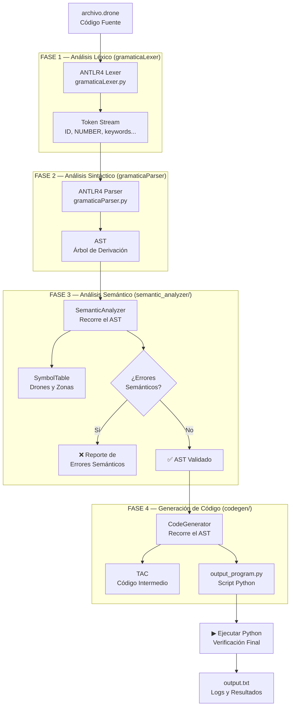

# DroneScript — Mini-Compilador para Control de Drones
**Materia:** Compiladores | **Universidad Cooperativa de Colombia**  
**Asignatura:** Compiladores | **Docente:** Mg. Gustavo Sanchez Rodriguez

---

## Arquitectura del Compilador



---

## Estructura del Proyecto

```
drone_compiler/
├── main.py                        ← Pipeline completo del compilador
├── gramatica.g4                   ← Gramática ANTLR4 (léxica + sintáctica)
├── input.txt                      ← Caso de prueba principal
├── output_program.py              ← Python generado (auto)
├── output.txt                     ← Logs de ejecución (auto)
├── run_tests.py                   ← Automatización de 20 pruebas
├── setup.sh                       ← Configura entorno y genera archivos ANTLR4
│
├── generated/                     ← Generado por ANTLR4 (no editar)
│   ├── gramaticaLexer.py
│   ├── gramaticaParser.py
│   └── gramaticaVisitor.py
│
├── semantic_analyzer/
│   └── semantic_analyzer.py       ← Análisis semántico + tabla de símbolos
│
├── codegen/
│   └── code_generator.py          ← TAC + traducción a Python
│
└── tests/
    ├── valid/                     ← 10 pruebas válidas (.drone)
    └── invalid/                   ← 10 pruebas con errores (.drone)
```

---

## Instalación y Ejecución (GitHub Codespace)

### 1. Setup inicial
```bash
chmod +x setup.sh
./setup.sh
```
Esto: instala `antlr4-python3-runtime`, descarga el JAR de ANTLR4, genera el Lexer/Parser/Visitor en `generated/`.

### 2. Compilar el caso principal
```bash
python3 main.py input.txt output_program.py output.txt
```

### 3. Correr todas las pruebas (20 casos)
```bash
python3 run_tests.py
```

### 4. Compilar manualmente un test
```bash
python3 main.py tests/valid/test_01_basico.drone out.py out.log
python3 main.py tests/invalid/test_e03_doble_despegue.drone out.py out.log
```

---

## Fases del Compilador

### Fase 1 — Análisis Léxico
ANTLR4 convierte el texto fuente en tokens usando las reglas léxicas de `gramatica.g4`. Tokens: palabras clave (`drone`, `mision`, `despegar`…), identificadores (`ID`), números (`NUMBER`), símbolos.

### Fase 2 — Análisis Sintáctico
El Parser construye el **Árbol de Sintaxis Abstracta (AST)** verificando que la estructura del programa siga la gramática. Detecta errores como llaves faltantes o tokens inesperados.

### Fase 3 — Análisis Semántico
`SemanticAnalyzer` recorre el AST y aplica las reglas de contexto:
- Drones y zonas deben declararse antes de usarse
- Un drone debe despegar antes de moverse/girar/hover/ir_a
- No se puede despegar un drone que ya está en vuelo
- Los valores de movimiento deben ser positivos
- Las zonas en `ir_a` deben existir
- Advertencia de batería antes de ejecutar misiones

### Fase 4 — Generación de Código Intermedio y Python
`CodeGenerator` produce:
1. **TAC (Three-Address Code)**: representación intermedia legible
2. **Script Python ejecutable**: traducción directa del programa fuente

---

## Reglas Semánticas Implementadas

| Regla | Tipo | Descripción |
|---|---|---|
| Drone no declarado | Error | Usar drone sin declarar con `drone ID;` |
| Zona no declarada | Error | Usar zona en `ir_a` sin declarar con `zona ID(x,y);` |
| Mover sin despegar | Error | `mover` antes de `despegar` |
| Aterrizar sin vuelo | Error | `aterrizar` cuando no está en vuelo |
| Doble despegue | Error | `despegar` un drone ya en vuelo |
| Hover sin vuelo | Error | `hover` sin estar en vuelo |
| Valor no positivo | Error | Movimiento o giro con valor ≤ 0 |
| Batería baja | Advertencia | Aviso antes de ejecutar misiones |
| Drone duplicado | Error | Declarar el mismo drone dos veces |

---

## División del Trabajo (Sustentación)

| Persona | Tema | Archivos |
|---|---|---|
| **Integrante 1** | Gramática ANTLR4, análisis léxico y sintáctico, arquitectura | `gramatica.g4`, `main.py`, `setup.sh` |
| **Integrante 2** | Análisis semántico, tabla de símbolos, reglas y errores | `semantic_analyzer/semantic_analyzer.py` |
| **Integrante 3** | Generación de código TAC+Python, pruebas y documentación | `codegen/code_generator.py`, `run_tests.py`, `tests/` |

---

## Ejemplo de Entrada y Salida

**Entrada (`input.txt`):**
```
drone halcon;
zona base(0, 0);
zona punto_a(10, 5);

mision patrulla {
    despegar halcon;
    mover halcon arriba 15;
    ...
}
```

**Salida (`output_program.py`):**
```python
import time

halcon = {'en_vuelo': False, 'x': 0.0, 'y': 0.0, 'altitud': 0.0, 'bateria': 100, 'orientacion': 0}
zonas = {'base': (0.0, 0.0), 'punto_a': (10.0, 5.0)}

def patrulla():
    # despegar halcon
    halcon['en_vuelo'] = True
    halcon['altitud'] = 1.0
    ...
```
